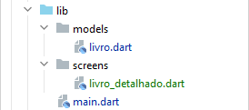
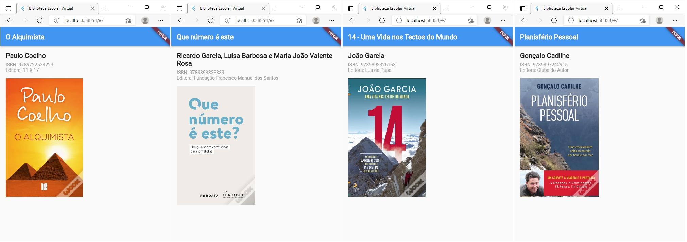
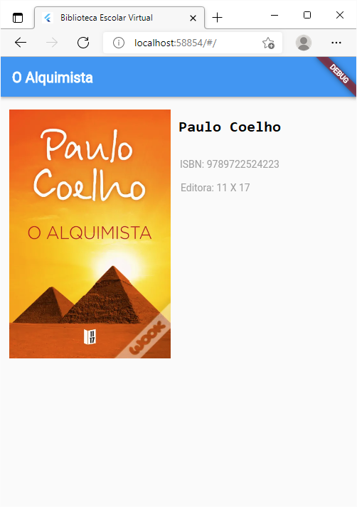

# Biblioteca Escolar

_estamos no ramo:_ `Livro Detalhado`

---

Queremos agora começar a organizar o nosso código e "embelezar" o ecrã onde apresentamos os detalhes de um livro.

Começamos por mover a entidade Livro para a pasta models. E criamos uma pasta screens para colocar as nossas widgets,
neste caso só temos a do _LivroDetalhado_.



Embelezemos então o nosso ecrã do _LivroDetalhado_.

No IntelliJ, clicamos com o rato na widget _Column_ podemos e fazemos `Alt+Enter` e fazemos clicamos na opção 'Wrap with
Padding' - isto apenas vai acrescentar um espaço à volta das várias widgets que estão na _Column_.

Acrescentamos mais uns detalhes nas widgets _Text_ e acrescentamos outras aqui e ali e obtemos isto:


E "apenas" o que fizemos foi alterar a nossa widget _LivroDetalhado_:

```dart
class LivroDetalhado extends StatelessWidget {
  const LivroDetalhado({Key? key, required this.livro}) : super(key: key);

  final Livro livro;

  @override
  Widget build(BuildContext context) {
    return Scaffold(
      appBar: AppBar(
        title: Text(
          livro.titulo,
          style: TextStyle(fontWeight: FontWeight.bold),
        ),
      ),
      body: Padding(
        padding: const EdgeInsets.all(16.0),
        child: Column(
          crossAxisAlignment: CrossAxisAlignment.start,
          children: [
            Text(
              livro.autor,
              style: TextStyle(fontWeight: FontWeight.bold, fontSize: 20.0),
            ),
            SizedBox(
              height: 8,
            ),
            Text(
              "ISBN: " + livro.isbn,
              style: TextStyle(color: Colors.grey),
            ),
            Text(
              "Editora: " + livro.editora,
              style: TextStyle(color: Colors.grey),
            ),
            SizedBox(
              height: 16,
            ),
            Container(
              height: 350,
              child: Image.network(livro.imagePath),
            )
          ],
        ),
      ),
    );
  }
}
```

O que obtemos com este código simples e estes embelezamentos é que podemos ver os vários livros que colocámos na
variável _livros_ do nosso _main.dart_ facilmente.

Mostramos aqui os quatro livros de exemplo tendo para isso mudado apenas o livro que passámos à widget _LivroDetalhado_:



__Dica:__ Se experimentarmos mudar a função _gerarLivrosAleatorios_ podemos alterar o texto que a widget
_LivroDetalhado_ apresenta - e isto sem mudar novamente o ecrã. Portanto estes dados, que agora são gerados na nossa
aplicação, no futuro podem vir da base de dados.

__Nota:__ O layout apresentado neste ecrã é apenas ilustrativo. Podiamos ter várias variantes, por exemplo:



Podemos dizer que somos apenas limitados pela nossa imaginação (e na maioria das vezes, limitado por aquilo que o
cliente gosta ou quer).

No próximo passo, no ramo `ListaDeLivros`, iremos mudar a página inicial para agora apresentar uma lista de livros
disponíveis.
