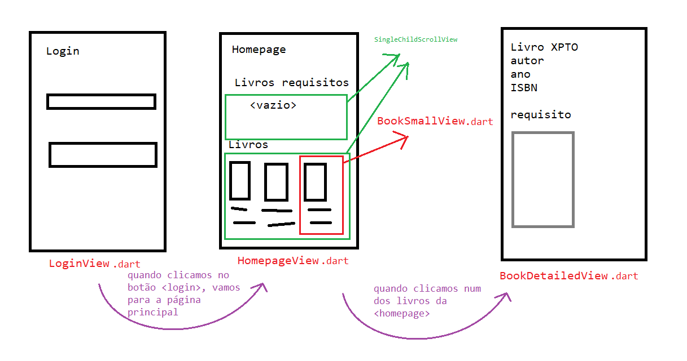

# Biblioteca Escolar

O nosso objectivo é desenvolver uma aplicação que permita uma biblioteca escolar gerir os seus livros e mais importante
permitir agilizar a requisição dos livros pelos seus utilizadores.

Pretende-se começar com pequenas funcionalidades e ir crescendo.

Começamos por reflectir o que a aplicação irá ter que nos apresentar e como eventualmente vai funcionar. Para isso
fazemos um esboço no nosso papel digital. Algo deste género:

__Mas já estamos a complicar__, estamos a misturar a implementação (e.g. LoginView.dart, SingleChildScrollView, etc)
com o que realmente queremos a nível de funcionalidades.

__Vamos simplificar__.

Para continuar, muda o _ramo / branch_ do repositório para: `Livro`
