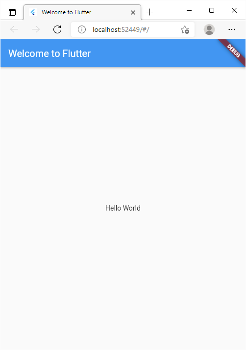
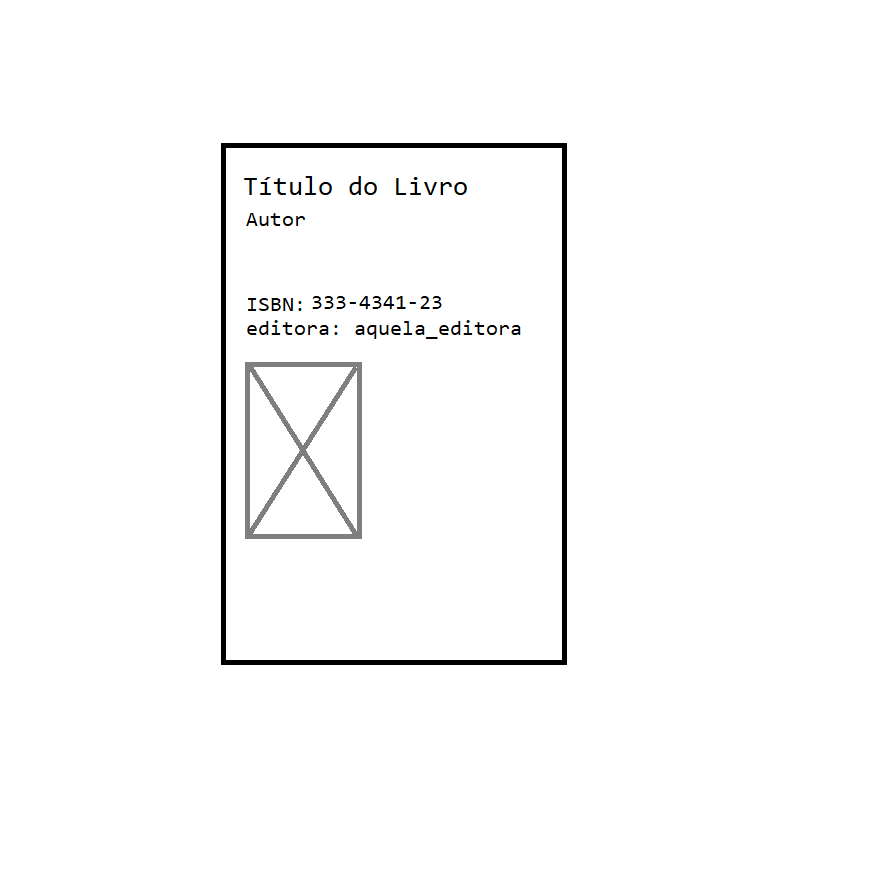
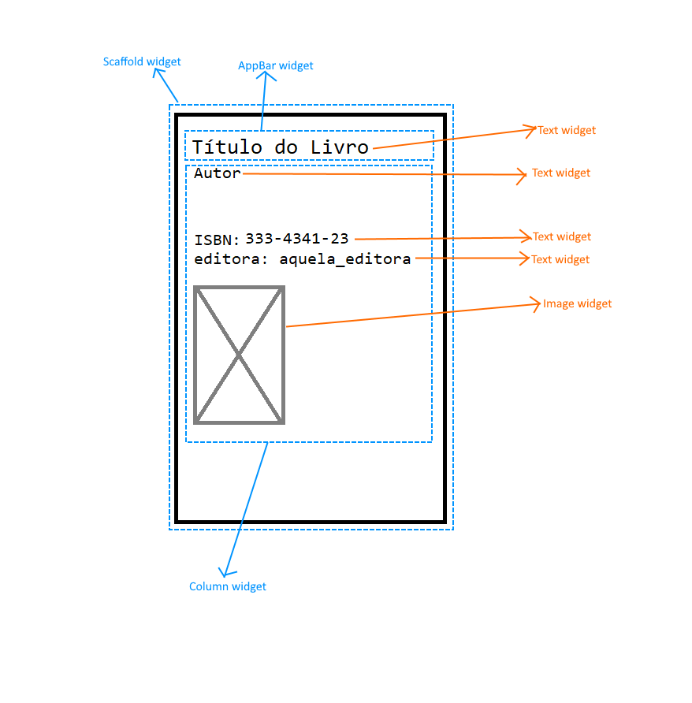
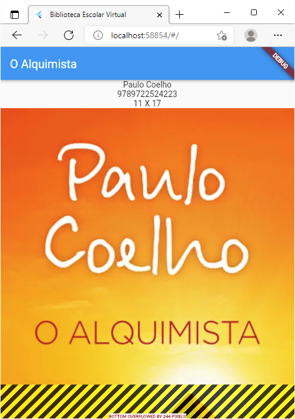
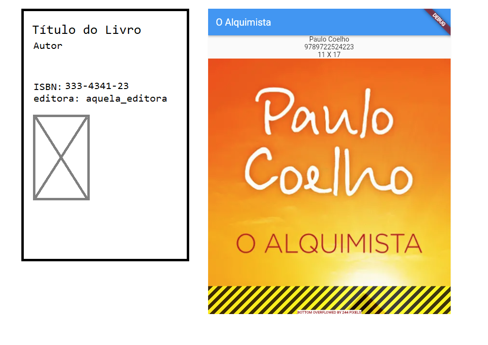

# Biblioteca Escolar

_estamos no ramo:_ `Livro`

---

Relembramo-nos que o objectivo é desenvolver uma aplicação que permita uma biblioteca escolar gerir os seus livros e
mais importante permitir agilizar a requisição dos livros pelos seus utilizadores.

Mas o que obtivemos no passo anterior foi um esboço do que queriamos e acabámos por complicar (podes mudar para o ramo e
ver o obtivemos).

## Começar...

Começamos então com uma aplicação muito simples:

```dart
import 'package:flutter/material.dart';

void main() {
  runApp(const MyApp());
}

class MyApp extends StatelessWidget {
  const MyApp({Key? key}) : super(key: key);

  @override
  Widget build(BuildContext context) {
    return MaterialApp(
      title: 'Welcome to Flutter',
      home: Scaffold(
        appBar: AppBar(
          title: const Text('Welcome to Flutter'),
        ),
        body: const Center(
          child: Text('Hello World'),
        ),
      ),
    );
  }
}
```

Que resulta em:



#### Livro

Em vez de começarmos logo a pensar em muito écrans, como fizemos inicialmente, vamos pensar que a aplicação vai
funcionar em torno deste conceito que é um Livro.

Assim, um livro é a entidade fundamental da nossa aplicação e que a podemos representar da seguinte forma:

```dart
class Livro {
  final String titulo;
  final String autor;
  final String isbn;
  final String imagemCapa;

  const Livro(this.titulo, this.autor, this.isbn, this.imagemCapa);
}
```

Embora tenha pouca informação, por agora, é suficiente. Afinal queremos começar com algo simples, sem complicações.

Falta-nos apenas ter alguns livros na nossa aplicação para irmos testando-a. Para isso vamos fazer a seguinte função que
nos providencia um conjunto de livros:

```dart
List<Livro> gerarLivrosAleatorios() {
  return [
    const Livro(
        'O Alquimista',
        'Paulo Coelho',
        '9789722524223',
        '11 X 17',
        'https://img.wook.pt/images/o-alquimista-paulo-coelho/MXwxNTIzNzEzOXwxMDcyNTQ3NXwxMzgzNTIzMjAwMDAwfHdlYnA=/502x'),
    const Livro(
        'Que número é este',
        'Ricardo Garcia, Luísa Barbosa e Maria João Valente Rosa',
        '9789898838889',
        'Fundação Francisco Manuel dos Santos',
        'https://img.wook.pt/images/que-numero-e-este-ricardo-garcia/MXwyNDAwNjIyNHwyMDA1MjUxN3wxNTg3NDIzNjAwMDAwfHdlYnA=/502x'),
    const Livro(
        '14 - Uma Vida nos Tectos do Mundo',
        'João Garcia',
        '9789892326153',
        'Lua de Papel',
        'https://img.wook.pt/images/14-uma-vida-nos-tectos-do-mundo-joao-garcia/MXwxNTcyNDIwNXwxMTIxOTMwMnwxMzk4OTg1MjAwMDAwfHdlYnA=/502x'),
    const Livro(
        'Planisfério Pessoal',
        'Gonçalo Cadilhe',
        '9789897242915',
        'Clube do Autor',
        'https://img.wook.pt/images/planisferio-pessoal-goncalo-cadilhe/MXwxNzgxNzY4M3wxMzQ1ODk0NnwxNDYwNDE1NjAwMDAwfHdlYnA=/502x'),
  ];
}
```

Agora que temos na nossa aplicação uma forma de guardar as informações de um livro e um conjunto de livros, o próximo
passo é implementar um ecrã para apresentar essa informação ao utilizador.

__Nota:__ estes dados só vão ser usados para testarmos a aplicação no início, serão depois apagados e a ideia será
carregar os mesmo a partir de uma base de dados.

#### Livro Detalhado

Mas antes de programar, esboçamos mais um desenho no nosso papel digital para nos guiarmos na implementação.

Novamente, queremos começar com algo simples, talvez, algo como:



Para implementarmos isto podemos pensar em termos de _widgets_ (porque estamos a implementar em _Flutter_).

Temos uma widget _Scaffold_ com uma _AppBar_ (onde o _title_ é uma _Text_) e uma _Column_ (com um conjunto de _Text_ e
uma _Image_).

__Nota:__ existem várias formas de fazer estas widgets, mas por agora estamos a seguir o _cookbook_
`Send data to a new screen`[^1].



Tendo este desenho em mente, alteramos a nossa _MyApp_ ficando com:

```dart
class MyApp extends StatelessWidget {
  const MyApp({Key? key}) : super(key: key);

  @override
  Widget build(BuildContext context) {
    return MaterialApp(
      title: 'Biblioteca Escolar Virtual',
      home: LivroDetalhado(livro: livros[0]),
    );
  }
}
```

E implementamos a widget _LivroDetalhado_ assim:

```dart
class LivroDetalhado extends StatelessWidget {
  const LivroDetalhado({Key? key, required this.livro}) : super(key: key);

  final Livro livro;

  @override
  Widget build(BuildContext context) {
    return Scaffold(
      appBar: AppBar(
        title: Text(livro.titulo),
      ),
      body: Column(
        children: [
          Text(livro.autor),
          Text(livro.isbn),
          Text(livro.editora),
          Image.network(livro.imagePath)
        ],
      ),
    );
  }
}
```

O que fizemos foi apenas abstrair a widget _Scaffold_, que antes era parte da nossa _MyApp_, para uma nova widget
_LivroDetalhado_. Nesta nova widget acrescentámos ainda mais algumas widgets de modo a apresentarmos as informações de
um livro, tal como esboçado no nosso desenho inicialmente.

Isto resulta numa widget, que recebe uma entidade _Livro_ e que apresenta esses dados num ecrã. Isto resultou em:



Vendo o que fizemos no papel digital e o que implementámos lado a lado, podemos argumentar que não está muito igual ao
que tinhamos idealizado.

Na nossa implementação parece que o texto está centrado, a imagem parece desproporcional em relação ao ecrã, parece
faltar alguns embelezamentos, etc.



Mas se olharmos com atenção verificamos que, afinal e independentemente do seu aspecto inicial VS o que implementámos,
estamos de facto a visualizar os detalhes de um livro. E fizemos isto sem grande esforço e sem complicar muito a nossa
aplicação.

No próximo passo, no ramo `LivroDetalhado`, vamos tratar de começar a organizar o nosso código em pastas e embelezar o
ecrã onde mostramos os detalhes de um livro.

[^1]: [Send data to a new screen](https://docs.flutter.dev/cookbook/navigation/passing-data)
